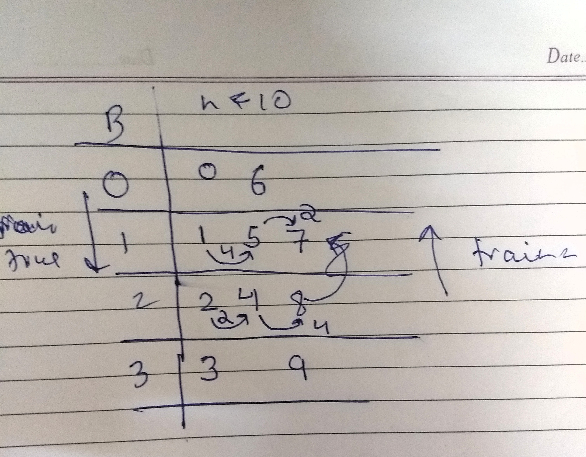

# Zigzag String

Asked in: **Paypal**

The string **"PAYPALISHIRING"** is written in a zigzag pattern on a given number of rows like this: (you may want to display this pattern in a fixed font for better legibility)

```
P.......A........H.......N
..A..P....L....S....I...I....G
....Y.........I........R
```

And then read line by line: **PAHNAPLSIIGYIR**
Write the code that will take a string and make this conversion given a number of rows:

```
string convert(string text, int nRows);
convert("PAYPALISHIRING", 3) should return "PAHNAPLSIIGYIR"
```

**Example 2 : **
ABCD, 2 can be written as

```
A....C
...B....D
```

and hence the answer would be **ACBD**.

## Solution Approach

Just look at simply simulating what is being told in the problem.

Follow the simple steps:

- You need to maintain numRows number of strings S[numRows].
- And then populating string S in each row in zigzag fashion.
- Finally concatenate S[0] .. S[numRows-1] to get the answer.

## Code - 1

This code is simplest. We are just maintaing B rows and adding string to following row.
Just following what is specified in _solution approach_.

```python
class Solution:
	# @param A : string
	# @param B : integer
	# @return a strings
	def convert(self, A, B):
	    n = len(A)
	    j = 1
        c = 1
        res = ['']*B
        for i in range(n):
            res[j - 1] += A[i]
            if j >= B:
                c = -1
            elif j <= 1:
                c = 1
            j += c
        return ''.join(res)
```

## Code - 2

Take this example for B = 4, len(A) = 10
Now,
for i = 5, where should this be placed, in which row?
let's take modulo_by = B + B - 2
this means,

```
i = 0, in row 0
i = 1, in row 1
i = 2, in row 2
i = 3, in row 3
i = 4 in ....
```

for i = 4,
_mod = i % modulo_by = 4_
now if mod >= B

subtract mod from modulo_by
mod = 6 - 4 = 2

```python
class Solution:
    # @param A : string
    # @param B : integer
    # @return a strings
    def convert(self, A, B):
        if B < 2:
            return A
        modulo_by = B + (B - 2)
        zigzag = [""] * B
        for i, char in enumerate(A):
            modulo = i % modulo_by
            if modulo >= B:
                modulo = modulo_by - modulo
            zigzag[modulo] += char
        return "".join(zigzag)
```

## Code - 3

This code is not straight forward.



```python
class Solution:
    # @param A : string
    # @param B : integer
    # @return a strings
    def convert(self, A, B):
        if len(A) <= B:
            return A
        if B == 1:
            return A

        newStr = ''
        for lnum in xrange(0, B):
            chIDX = lnum
            trian = False
            while chIDX < len(A):
                newStr += A[chIDX]
                if not lnum or lnum == B - 1:
                    chIDX += (B - 1) * 2
                elif not trian:
                    chIDX += (B - 1 - lnum) *2
                else:
                    chIDX += lnum * 2
                trian = not trian
                print(lnum, chIDX, chIDX < len(A))
        return newStr
```
